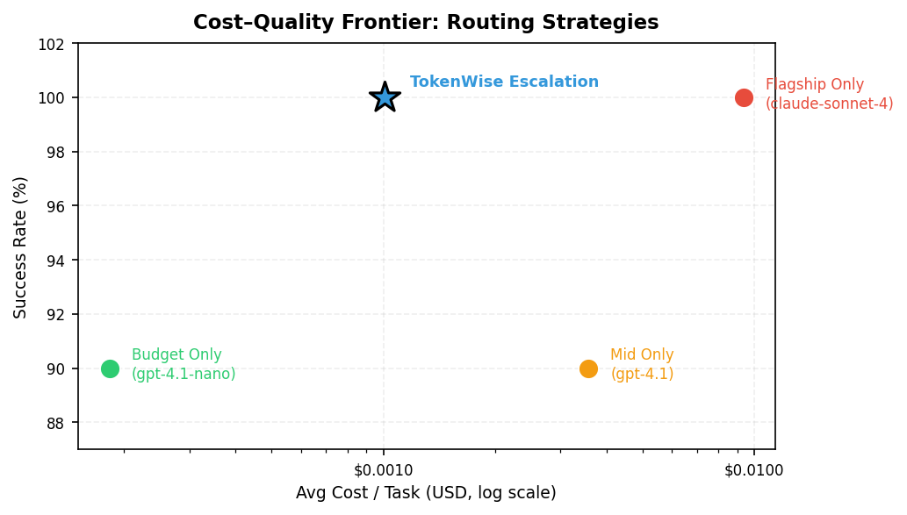

<p align="center">
  
</p>

<h1 align="center">TokenWise</h1>

<p align="center">
  <a href="https://github.com/itsarbit/tokenwise/actions/workflows/ci.yml"></a>
  <a href="https://www.python.org"></a>
  <a href="LICENSE"></a>
  <a href="https://pypi.org/project/tokenwise-llm/"></a>
</p>

<p align="center">
Production-grade LLM routing with budget ceilings,
tiered escalation, and multi-provider failover.
</p>

## 30-Second Demo

```bash
pip install tokenwise-llm

# Route a query to the best model within budget
tokenwise route "Debug this segfault" --strategy best_quality --budget 0.05

# Decompose a task, execute it, track spend
tokenwise plan "Write a Python function to validate email addresses, \
  then write unit tests for it" --budget 0.05 --execute
```

Example output:

```
Plan: 4 steps | Budget: $0.05 | Estimated: $0.0002

Status: Success | Total cost: $0.0007 | Budget remaining: $0.0493
```

## Install

```bash
pip install tokenwise-llm
```

## Quick Start

### Set your API key

```bash
export OPENROUTER_API_KEY="sk-or-..."
```

> TokenWise uses [OpenRouter](https://openrouter.ai) as the
> default gateway. Set `OPENAI_API_KEY`, `ANTHROPIC_API_KEY`, or
> `GOOGLE_API_KEY` to bypass OpenRouter for those providers.

### CLI

```bash
tokenwise route "Write a haiku about Python"
tokenwise route "Debug this segfault" --strategy best_quality --budget 0.05
tokenwise plan "Build a REST API" --budget 0.50 --execute
tokenwise ledger --summary
tokenwise serve --port 8000
tokenwise models
```

### Python API

```python
from tokenwise import Router, Planner, Executor

# Route a single query
router = Router()
model = router.route("Explain quantum computing", strategy="balanced", budget=0.10)
print(f"{model.id} (${model.input_price}/M input)")

# Plan and execute a complex task
planner = Planner()
plan = planner.plan(task="Build a REST API for a todo app", budget=0.50)

executor = Executor()
result = executor.execute(plan)
print(f"Cost: ${result.total_cost:.4f}, success: {result.success}")
```

### OpenAI-compatible proxy

```bash
tokenwise serve --port 8000
```

```python
from openai import OpenAI

client = OpenAI(base_url="http://localhost:8000/v1", api_key="unused")
response = client.chat.completions.create(
    model="auto",  # TokenWise picks the best model
    messages=[{"role": "user", "content": "Hello!"}],
)
```

## Core Features

**Budget-aware routing** — strict cost ceilings with
conservative estimation and enforced `max_tokens` caps (1.2x
safety margin). Configure `TOKENWISE_MIN_OUTPUT_TOKENS`
(default 100) for workflows that need tiny outputs under tight
budgets.

**Tiered escalation** — three tiers (budget, mid, flagship). On
failure, escalates strictly upward, never downward. A failed code
model is replaced by a stronger code model, not a generic one.

**Capability-aware selection** — routes and fallbacks filtered by
`code`, `reasoning`, `math`, or `general`. Capabilities are
tracked per step, not inferred at retry time.

**Task decomposition** — breaks complex tasks into subtasks via
an LLM planner, assigns the cheapest capable model to each step,
and runs independent steps concurrently via async DAG scheduling.

**Cost ledger** — every LLM call is recorded, including failed
attempts and escalations. Persisted to JSONL across sessions.

**Multi-provider failover** — OpenRouter, OpenAI, Anthropic, and
Google. Direct API keys bypass OpenRouter automatically. The
proxy shares a single `httpx.AsyncClient` for connection pooling.

## Benchmarks



TokenWise escalation achieves flagship-level reliability at
~9x lower cost than running flagship models exclusively.

`benchmarks/strategy_pareto.py` runs 20 tasks (simple,
reasoning, coding, hard) across four strategies and validates
answer correctness. Single command to reproduce:

```bash
uv sync --group benchmark && uv run python benchmarks/strategy_pareto.py
```

Results (February 2026, 20 tasks per strategy):

| Strategy | Success | Avg Cost / Task |
|---|---|---|
| Budget Only (gpt-4.1-nano) | 90% | $0.000183 |
| Mid Only (gpt-4.1) | 90% | $0.003573 |
| Flagship Only (claude-sonnet-4) | 100% | $0.009354 |
| **TokenWise Escalation** | **100%** | **$0.001009** |

Budget-only is cheapest but gets reasoning tasks wrong.
Flagship is strongest but 51x more expensive. Escalation
starts cheap, detects failures, and upgrades — achieving
100% success at a fraction of the flagship cost.

## How It Works

### Architecture Overview

```
┌───────────────────────────────────────────────────────┐
│                       TokenWise                       │
│                                                       │
│  ┌────────────┐  ┌────────────┐  ┌────────────┐       │
│  │   Router   │  │  Planner   │  │  Executor  │       │
│  │            │  │            │  │            │       │
│  │  1. Detect │  │  Breaks    │  │  Runs the  │       │
│  │  scenario  │  │  task into │  │  plan,     │       │
│  │  2. Route  │  │  steps +   │  │  tracks    │       │
│  │  within    │  │  assigns   │  │  spend,    │       │
│  │  budget    │  │  models    │  │  retries   │       │
│  └─────┬──────┘  └─────┬──────┘  └─────┬──────┘       │
│        │               │               │              │
│        └───────────────┼───────────────┘              │
│                        ▼                              │
│          ┌──────────────────────────┐                 │
│          │    ProviderResolver      │  ← LLM calls    │
│          │                          │                 │
│          │  OpenAI    · Anthropic   │                 │
│          │  Google    · OpenRouter  │                 │
│          └──────────────────────────┘                 │
│                                                       │
│            ┌──────────────┐                           │
│            │   Registry   │  ← metadata + pricing     │
│            └──────────────┘                           │
└───────────────────────────────────────────────────────┘
```

### Router Pipeline

The router uses a two-stage pipeline: detect what the query
needs, then choose how to spend.

```
            ┌───────────────────┐    ┌──────────────────┐
 query ───▶ │  1. Detect        │───▶│  2. Route        │───▶ model
            │     Scenario      │    │     w/ Strategy   │
            │                   │    │                   │
            │  · capabilities   │    │  · filter budget  │
            │    (code, reason, │    │  · cheapest /     │
            │     math)         │    │    balanced /     │
            │  · complexity     │    │    best_quality   │
            │    (simple→hard)  │    │                   │
            └───────────────────┘    └──────────────────┘
```

Budget is a universal parameter on all strategies. By default
the budget is a hard ceiling; pass `budget_strict=False` to fall
back to best-effort.

### Planner and Executor

**Planner** decomposes a task into subtasks using a cheap LLM,
assigns the optimal model to each step within budget, and
auto-downgrades expensive steps if over budget.

**Executor** runs the plan via async DAG scheduling, tracks
actual cost via `CostLedger`, and escalates to stronger models
on failure (flagship before mid, filtered by capability).

If `executor.execute(plan)` is called inside an existing event
loop (Jupyter, FastAPI), it falls back to sequential execution.
Use `await executor.aexecute(plan)` directly for concurrent DAG
scheduling in async code.

### Observability

Every execution produces a structured trace:

```python
result = executor.execute(plan)

for sr in result.step_results:
    print(f"Step {sr.step_id}: model={sr.model_id}, "
          f"cost=${sr.actual_cost:.4f}, escalated={sr.escalated}")

for entry in result.ledger.entries:
    print(f"  {entry.reason}: {entry.model_id} "
          f"({entry.input_tokens}in/{entry.output_tokens}out) "
          f"${entry.cost:.6f} {'ok' if entry.success else 'FAIL'}")

print(f"Total: ${result.total_cost:.4f}, "
      f"wasted: ${result.ledger.wasted_cost:.4f}, "
      f"remaining: ${result.budget_remaining:.4f}")
```

Example output when step 1 fails and escalates:

```
Step 1: model=openai/gpt-4.1, cost=$0.0052, escalated=True
  step 1 attempt 1: openai/gpt-4.1-mini (82in/0out) $0.000000 FAIL
  step 1 escalation attempt 1: openai/gpt-4.1 (82in/204out) $0.001800 ok
Total: $0.0052, wasted: $0.0000, remaining: $0.9948
```

### Routing Strategies

| Strategy | When to Use | How It Works |
|---|---|---|
| `cheapest` | Minimize cost | Lowest-price capable model |
| `best_quality` | Maximize quality | Best flagship-tier capable model |
| `balanced` | Default | Matches model tier to query complexity |

## Comparison

High-level comparison of major LLM routing tools (as of
February 2026). Corrections welcome via
[issues](https://github.com/itsarbit/tokenwise/issues).

| Feature | TokenWise | [RouteLLM](https://github.com/lm-sys/RouteLLM) | [LiteLLM](https://github.com/BerriAI/litellm) | [Not Diamond](https://notdiamond.ai) | [Martian](https://withmartian.com) | [Portkey](https://portkey.ai) | [OpenRouter](https://openrouter.ai) |
|---|:---:|:---:|:---:|:---:|:---:|:---:|:---:|
| Task decomposition | **Yes** | - | - | - | - | - | - |
| Strict budget ceiling | **Yes** | - | Yes | - | Per-request | Yes | Yes |
| Tier-based escalation | **Yes** | - | Yes | - | - | Yes | - |
| Capability-aware fallback | **Yes** | - | - | Partial | Yes | Partial | Partial |
| Cost ledger | **Yes** | - | Yes | - | - | Yes | Dashboard |
| OpenAI-compatible proxy | **Yes** | Yes | Yes | Yes | Yes | Yes | Yes |
| CLI | **Yes** | - | Yes | - | - | - | - |
| Self-hosted / open source | **Yes** | Yes | Yes | - | - | Gateway only | - |

## Known Limitations (v0.4)

All three v0.3 limitations have been resolved:

- ~~Planner cost not budgeted~~ — tracked and deducted (v0.4)
- ~~Linear execution~~ — parallel DAG scheduling (v0.4)
- ~~No persistent spend tracking~~ — JSONL ledger (v0.4)

## Budget Semantics

TokenWise enforces budget ceilings by capping `max_tokens`
before each LLM call. Input token counts are estimated using a
`chars / 4` heuristic with a 1.2x safety margin — not a
tokenizer. The budget ceiling is real and enforced, but small
overruns are possible when the heuristic underestimates input
tokens. A future release will support pluggable tokenizer-based
estimation for stricter guarantees.

## Configuration

TokenWise reads configuration from environment variables and
an optional config file (`~/.config/tokenwise/config.yaml`).

| Variable | Required | Description | Default |
|---|---|---|---|
| `OPENROUTER_API_KEY` | **Yes** | OpenRouter API key | — |
| `OPENAI_API_KEY` | Optional | Direct OpenAI API key | — |
| `ANTHROPIC_API_KEY` | Optional | Direct Anthropic API key | — |
| `GOOGLE_API_KEY` | Optional | Direct Google AI API key | — |
| `OPENROUTER_BASE_URL` | Optional | OpenRouter base URL | `https://openrouter.ai/api/v1` |
| `TOKENWISE_DEFAULT_STRATEGY` | Optional | Routing strategy | `balanced` |
| `TOKENWISE_DEFAULT_BUDGET` | Optional | Budget in USD | `1.00` |
| `TOKENWISE_PLANNER_MODEL` | Optional | Decomposition model | `openai/gpt-4.1-mini` |
| `TOKENWISE_PROXY_HOST` | Optional | Proxy bind host | `127.0.0.1` |
| `TOKENWISE_PROXY_PORT` | Optional | Proxy bind port | `8000` |
| `TOKENWISE_CACHE_TTL` | Optional | Registry cache TTL (s) | `3600` |
| `TOKENWISE_LEDGER_PATH` | Optional | Ledger JSONL path | `~/.config/tokenwise/ledger.jsonl` |
| `TOKENWISE_MIN_OUTPUT_TOKENS` | Optional | Min output tokens per step | `100` |
| `TOKENWISE_LOCAL_MODELS` | Optional | Local models YAML | — |

```yaml
# ~/.config/tokenwise/config.yaml
default_strategy: balanced
default_budget: 0.50
planner_model: openai/gpt-4.1-mini
```

## Development

```bash
git clone https://github.com/itsarbit/tokenwise.git
cd tokenwise
uv sync
uv run pytest
uv run ruff check src/ tests/
uv run mypy src/
```

```
src/tokenwise/
├── models.py        # Pydantic data models
├── config.py        # Settings from env vars and config file
├── registry.py      # ModelRegistry — fetches/caches models
├── router.py        # Two-stage pipeline: scenario → strategy
├── planner.py       # Decomposes tasks, assigns models
├── executor.py      # Runs plans, tracks spend, escalates
├── ledger_store.py  # Persistent JSONL spend history
├── cli.py           # Typer CLI
├── proxy.py         # FastAPI OpenAI-compatible proxy
├── providers/       # LLM provider adapters
│   ├── openrouter.py
│   ├── openai.py
│   ├── anthropic.py
│   ├── google.py
│   └── resolver.py  # Maps model IDs → provider instances
└── data/
    └── model_capabilities.json
```

## Philosophy

LLM systems should be treated like distributed systems.
That means clear failure semantics, explicit cost ceilings,
predictable escalation, and observability. TokenWise is designed
with that philosophy.

> **Background reading:**
> [LLM Routers Are Not Enough](https://itsarbit.substack.com/p/llm-routers-are-not-enough)
> — the blog post that motivated TokenWise's design.

## License

MIT
