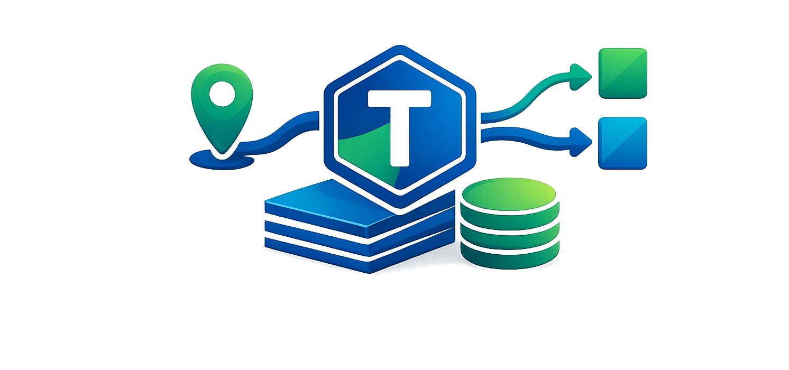

<p align="center">
  
</p>

<h1 align="center">TokenWise</h1>

<p align="center">
  <a href="https://github.com/itsarbit/tokenwise/actions/workflows/ci.yml"></a>
  <a href="https://www.python.org"></a>
  <a href="LICENSE"></a>
  <a href="https://pypi.org/project/tokenwise-llm/"></a>
</p>

<p align="center"><strong>Intelligent LLM Task Planner</strong> — decompose tasks, route to optimal models, enforce budgets.</p>

Existing LLM routers (RouteLLM, LLMRouter, Not Diamond) only do single-query routing: pick one model per request. TokenWise goes further in two ways. First, its router uses a **two-stage pipeline** — it detects the scenario (what capabilities the query needs, how complex it is) before applying your cost/quality preference, so every route is context-aware. Second, it **plans**: decomposes complex tasks into subtasks, assigns the right model to each step based on cost/quality/capability, enforces a token budget, and retries with a stronger model on failure.

> **Note:** TokenWise uses [OpenRouter](https://openrouter.ai) as the default model gateway for model discovery and routing. You can also use direct provider APIs (OpenAI, Anthropic, Google) by setting the corresponding API keys — when a direct key is available, requests for that provider bypass OpenRouter automatically.

## Features

- **Budget-aware planning** — "I have $0.50, get this done" → planner picks the cheapest viable path
- **Task decomposition** — Break complex tasks into subtasks, each routed to the right model
- **Model registry** — Knows model capabilities, prices, context windows (fetched from [OpenRouter](https://openrouter.ai))
- **Two-stage routing** — Every route detects the scenario first (capabilities + complexity), then applies your cost/quality preference within that context
- **OpenAI-compatible proxy** — Drop-in replacement with SSE streaming support; failed models are suppressed via a TTL-based cache (5 min default) to avoid repeated retries
- **Multi-provider** — Direct API support for OpenAI, Anthropic, and Google; falls back to OpenRouter. The proxy shares a single `httpx.AsyncClient` across all providers for connection pooling.
- **CLI** — `tokenwise plan`, `tokenwise route`, `tokenwise serve`, `tokenwise models`

## How It Works

```
┌───────────────────────────────────────────────────────┐
│                       TokenWise                       │
│                                                       │
│  ┌────────────┐  ┌────────────┐  ┌────────────┐       │
│  │   Router   │  │  Planner   │  │  Executor  │       │
│  │            │  │            │  │            │       │
│  │  1. Detect │  │  Breaks    │  │  Runs the  │       │
│  │  scenario  │  │  task into │  │  plan,     │       │
│  │  2. Route  │  │  steps +   │  │  tracks    │       │
│  │  within    │  │  assigns   │  │  spend,    │       │
│  │  budget    │  │  models    │  │  retries   │       │
│  └─────┬──────┘  └─────┬──────┘  └─────┬──────┘       │
│        │               │               │              │
│        └───────────────┼───────────────┘              │
│                        ▼                              │
│          ┌──────────────────────────┐                 │
│          │    ProviderResolver      │  ← LLM calls    │
│          │                          │                 │
│          │  OpenAI    · Anthropic   │                 │
│          │  Google    · OpenRouter  │                 │
│          └──────────────────────────┘                 │
│                                                       │
│            ┌──────────────┐                           │
│            │   Registry   │  ← metadata + pricing     │
│            └──────────────┘                           │
└───────────────────────────────────────────────────────┘
```

**Router** uses a two-stage pipeline for every request:

```
               ┌───────────────────┐      ┌────────────────────┐
 query ──────▶ │  1. Detect        │─────▶│  2. Route          │──────▶ model
               │     Scenario      │      │     with Strategy  │
               │                   │      │                    │
               │  · capabilities   │      │  · filter budget   │
               │    (code, reason, │      │  · cheapest /      │
               │     math)         │      │    balanced /      │
               │  · complexity     │      │    best_quality    │
               │    (simple → hard)│      │                    │
               └───────────────────┘      └────────────────────┘
```

Unlike single-step routers that treat model selection as a flat lookup, TokenWise separates *understanding what the query needs* from *choosing how to spend*. Budget is a universal parameter — not a strategy. By default, the router enforces the budget as a hard ceiling: if no model fits, it raises an error instead of silently exceeding the limit. (The planner's internal routing uses `budget_strict=False` to allow best-effort downgrading.)

**Planner** decomposes a complex task into subtasks using a cheap LLM, then assigns the optimal model to each step within your budget. If the plan exceeds budget, it automatically downgrades expensive steps.

**Executor** runs a plan step by step, tracks actual token usage and cost via a `CostLedger`, and escalates to a stronger model if a step fails. Escalation tries stronger tiers first (flagship before mid) and filters by the failed model's capabilities.

## Requirements

- Python >= 3.10
- An [OpenRouter](https://openrouter.ai) API key (for model discovery; also used for LLM calls unless direct provider keys are set)
- Optionally: `OPENAI_API_KEY`, `ANTHROPIC_API_KEY`, or `GOOGLE_API_KEY` for direct provider access

## Install

```bash
# With uv (recommended)
uv add tokenwise-llm

# With pip
pip install tokenwise-llm
```

## Quick Start

### 1. Set your OpenRouter API key

```bash
export OPENROUTER_API_KEY="sk-or-..."
```

### 2. CLI usage

```bash
# List available models and pricing
tokenwise models

# Route a single query to the best model
tokenwise route "Write a haiku about Python"

# Route with a specific strategy and budget ceiling
tokenwise route "Debug this segfault" --strategy best_quality --budget 0.05

# Plan a complex task with a budget
tokenwise plan "Build a REST API for a todo app" --budget 0.50

# Plan and execute immediately
tokenwise plan "Write unit tests for auth module" --budget 0.25 --execute

# Start the OpenAI-compatible proxy server
tokenwise serve --port 8000
```

### 3. Python API

```python
from tokenwise import Router, Planner
from tokenwise.executor import Executor

# Simple routing — detects scenario, picks best model within budget
router = Router()
model = router.route("Explain quantum computing", strategy="balanced", budget=0.10)
print(f"Use model: {model.id} (${model.input_price}/M input tokens)")

# Task planning with budget
planner = Planner()
plan = planner.plan(
    task="Build a REST API for a todo app",
    budget=0.50,
)
print(f"Plan: {len(plan.steps)} steps, estimated ${plan.total_estimated_cost:.4f}")

# Execute the plan
executor = Executor()
result = executor.execute(plan)
print(f"Done! Cost: ${result.total_cost:.4f}, success: {result.success}")
```

### 4. OpenAI-compatible proxy

Start the proxy, then point any OpenAI-compatible client at it:

```bash
tokenwise serve --port 8000
```

```python
from openai import OpenAI

# Point at TokenWise proxy — it routes automatically
client = OpenAI(base_url="http://localhost:8000/v1", api_key="unused")

response = client.chat.completions.create(
    model="auto",  # TokenWise picks the best model
    messages=[{"role": "user", "content": "Hello!"}],
)
```

## Routing Strategies

Every strategy goes through scenario detection first (capability + complexity), then applies its preference on the filtered candidate set:

| Strategy | When to Use | How It Works |
|---|---|---|
| `cheapest` | Minimize cost | Picks the lowest-price capable model |
| `best_quality` | Maximize quality | Picks the best flagship-tier capable model |
| `balanced` | Default | Matches model tier to query complexity (short→budget, long→flagship) |

All strategies accept an optional `--budget` parameter that acts as a hard cost ceiling. When provided, models whose estimated cost exceeds the budget are filtered out before the strategy preference is applied. If no model fits within the budget, routing raises an error rather than silently exceeding the limit. Pass `budget_strict=False` in the Python API to fall back to best-effort behavior.

## Configuration

TokenWise reads configuration from environment variables and an optional config file (`~/.config/tokenwise/config.yaml`).

| Variable | Required | Description | Default |
|---|---|---|---|
| `OPENROUTER_API_KEY` | **Yes** | OpenRouter API key (model discovery + fallback for LLM calls) | — |
| `OPENAI_API_KEY` | Optional | Direct OpenAI API key; falls back to OpenRouter if not set | — |
| `ANTHROPIC_API_KEY` | Optional | Direct Anthropic API key; falls back to OpenRouter if not set | — |
| `GOOGLE_API_KEY` | Optional | Direct Google AI API key; falls back to OpenRouter if not set | — |
| `OPENROUTER_BASE_URL` | Optional | OpenRouter API base URL | `https://openrouter.ai/api/v1` |
| `TOKENWISE_DEFAULT_STRATEGY` | Optional | Default routing strategy | `balanced` |
| `TOKENWISE_DEFAULT_BUDGET` | Optional | Default budget in USD | `1.00` |
| `TOKENWISE_PLANNER_MODEL` | Optional | Model used for task decomposition | `openai/gpt-4.1-mini` |
| `TOKENWISE_PROXY_HOST` | Optional | Proxy server bind host | `127.0.0.1` |
| `TOKENWISE_PROXY_PORT` | Optional | Proxy server bind port | `8000` |
| `TOKENWISE_CACHE_TTL` | Optional | Model registry cache TTL (seconds) | `3600` |
| `TOKENWISE_LOCAL_MODELS` | Optional | Path to local models YAML for offline use | — |

### Config file example

```yaml
# ~/.config/tokenwise/config.yaml
default_strategy: balanced
default_budget: 0.50
planner_model: openai/gpt-4.1-mini
```

## Architecture

```
src/tokenwise/
├── models.py          # Pydantic data models (ModelInfo, Plan, Step, etc.)
├── config.py          # Settings from env vars and config file
├── registry.py        # ModelRegistry — fetches/caches models from OpenRouter
├── router.py          # Router — two-stage pipeline: scenario → strategy
├── planner.py         # Planner — decomposes tasks, assigns models per step
├── executor.py        # Executor — runs plans, tracks spend, escalates on failure
├── cli.py             # Typer CLI (models, route, plan, serve)
├── proxy.py           # FastAPI OpenAI-compatible proxy server
├── providers/         # LLM provider adapters
│   ├── openrouter.py  #   OpenRouter (default, routes via openrouter.ai)
│   ├── openai.py      #   Direct OpenAI API
│   ├── anthropic.py   #   Direct Anthropic Messages API
│   ├── google.py      #   Direct Google Gemini API
│   └── resolver.py    #   Maps model IDs → provider instances
└── data/
    └── model_capabilities.json  # Curated model family → capabilities mapping
```

## Known Limitations (v0.3)

- **Linear execution** — plan steps run sequentially; parallel step execution is not yet implemented.
- **Planner cost not budgeted** — the LLM call used to decompose the task is not deducted from the user's budget.
- **No persistent spend tracking** — the `CostLedger` lives in memory for a single plan execution; there is no cross-session spend history yet.

## Development

```bash
git clone https://github.com/itsarbit/tokenwise.git
cd tokenwise
uv sync
uv run pytest
uv run ruff check src/ tests/
uv run mypy src/
```

## License

MIT
